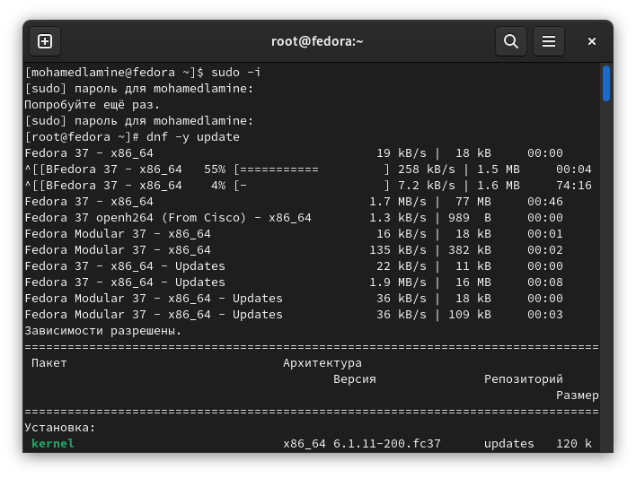
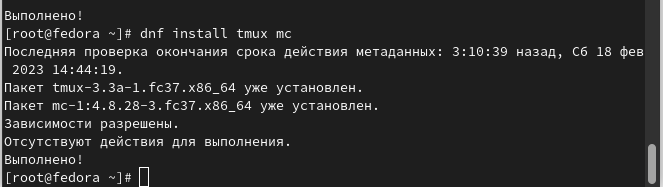
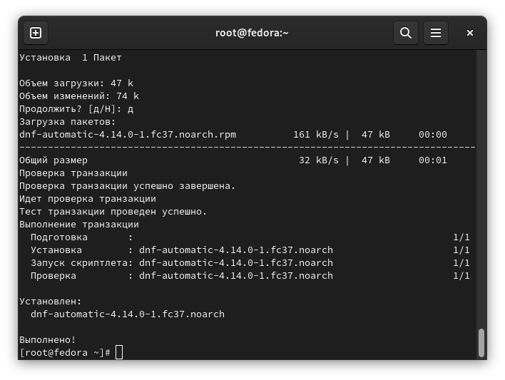
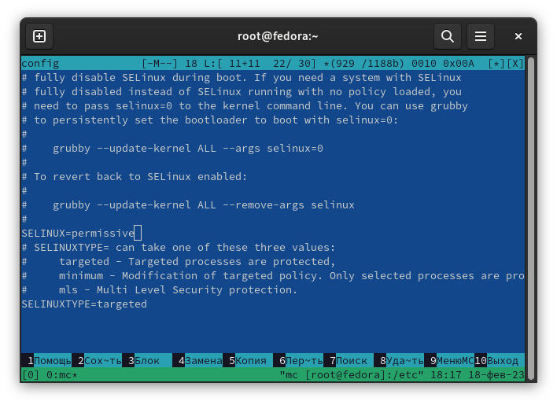
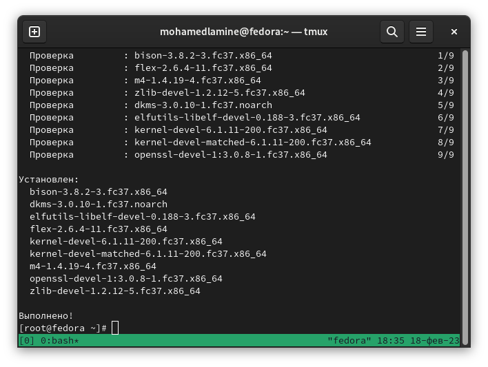
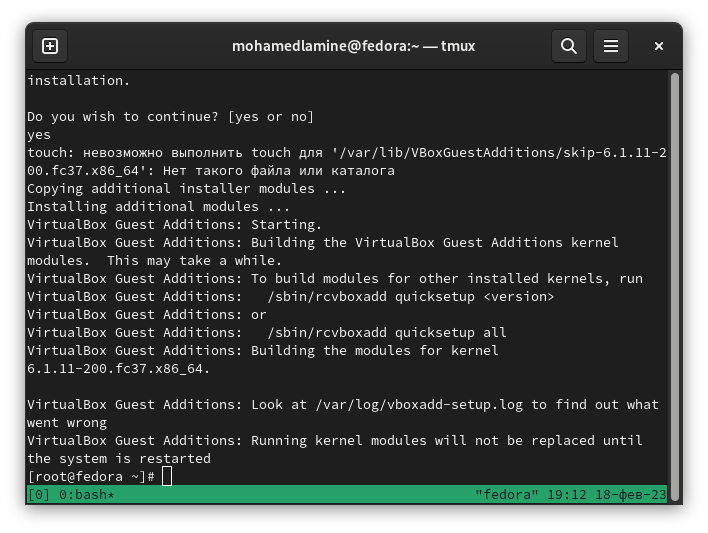
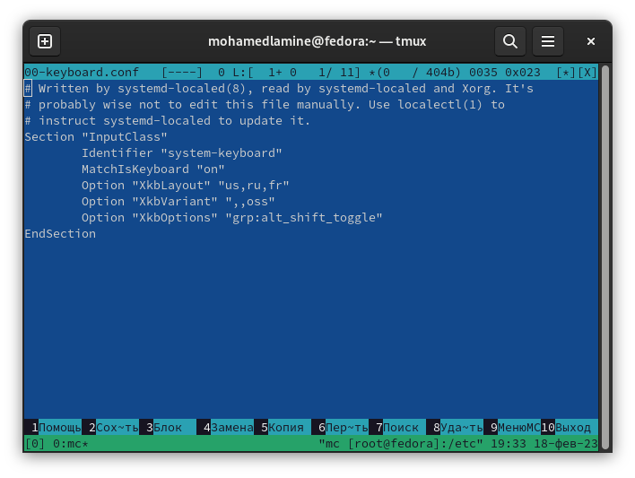
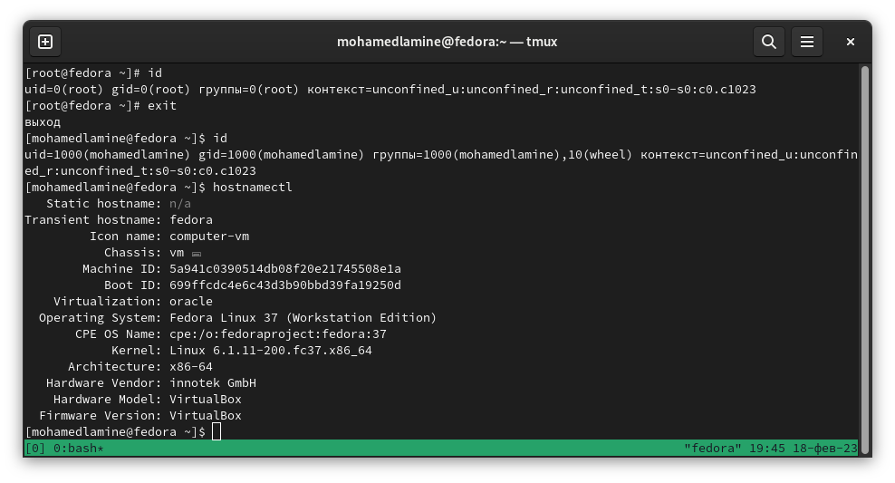
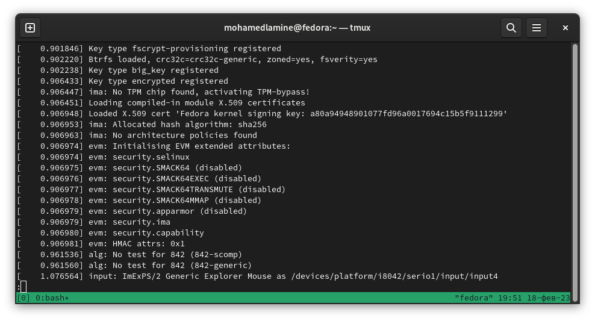

---
## Front matter
title: "Лабораторная работы №1. "
subtitle: "Установка и конфигурация операционной системы на виртуальную машину"
author: |
        сиссе мохамед ламин
  
## i18n babel
babel-lang: russian
babel-otherlangs: english

## Formatting pdf
toc: false
toc-title: Содержание
slide_level: 2
aspectratio: 169
section-titles: true
theme: metropolis
header-includes:
 - \metroset{progressbar=frametitle,sectionpage=progressbar,numbering=fraction}
 - '\makeatletter'
 - '\beamer@ignorenonframefalse'
 - '\makeatother'
---
# Цель работы

Целью данной работы является приобретение практических навыков установки операционной системы на виртуальную машину, настройки минимально необходимых для дальнейшей работы сервисов.

# Настройка каталога для виртуальных машин
# Настройка хост-клавиши
# Создание виртуальной машины

Все эти этапы были сделаны в прошлом семестре, результат этих пунктов был показан на видео

# После установки
# Обновления и повышение комфорта работы

{ #fig:001 width=80% }

{ #fig:002 width=80% }

# Автоматическое обновление

{ #fig:003 width=80%}

# Отключение SELinux

{ #fig:004 width=80% }

# Установка драйверов для VirtualBox

{ #fig:005 width=80%}

{ #fig:006 width=80%}

# Настройка раскладки клавиатуры

{ #fig:007 width=80%}

# Установка имени пользователя и названия хоста

{ #fig:008 width=80%}
              Все было установлено сразу правильно
              
              
# Домашнее Задание
{ #fig:009 width=80% }

{ #fig:010 width=80% }

# Контрольные Вопросы

1. Какую информацию содержит учётная запись пользователя?  

Имя пользователя, зашифрованный пароль пользователя, идентификационный номер пользователя, идентификационный номер группы пользователя, домашний каталог пользователя, командный интерпретатор пользователя. 

2. Укажите команды терминала и приведите примеры: – для получения справки по команде; – для перемещения по файловой системе; – для просмотра содержимого каталога; – для определения объёма каталога; – для создания / удаления каталогов / файлов; – для задания определённых прав на файл / каталог; – для просмотра истории команд. 

a) для получения справки по команде: man <название команды> 
b) для перемещения по файловой системе: cd  
c) для просмотра содержимого каталога: ls 
d) для определения объёма каталога: du <имя каталога> 
e) для создания каталогов: mkdir <имя каталога> 
f) для создания файлов: touch <имя файла> 
g) для удаления каталогов: rm <имя каталога> 
h) для удаления файлов: rm –r <имя фйала> 
i) для задания определённых прав на файл / каталог: chmod + x <имя файла/каталога> 
j) для просмотра истории команд: history 

3. Что такое файловая система? Приведите примеры с краткой характеристикой. 

Файловая система — это часть операционной системы, назначение которой состоит в 
том, чтобы обеспечить пользователю удобный интерфейс при работе с данными, 
хранящимися на диске, и обеспечить совместное использование файлов несколькими 
пользователями и процессами. 
Примеры файловых систем: 

• Ext2, Ext3, Ext4 или Extended Filesystem – стандартная файловая система для Linux. 
• JFS или Journaled File System была разработана в IBM для AIX UNIX и 
использовалась в качестве альтернативы для файловых систем ext. Она используется 
там, где необходима высокая стабильность и минимальное потребление ресурсов. 
• ReiserFS – была разработана намного позже, но в качестве альтернативы ext3 с 
улучшенной производительностью и расширенными возможностями. 
• XFS – это высокопроизводительная файловая система. Преимущества: высокая 
скорость работы с большими файлами, отложенное выделение места, увеличение 
разделов на лету и незначительный размер служебной информации. [3] 

4. Как посмотреть, какие файловые системы подмонтированы в ОС?  

С помощью команды mount. 

5. Как удалить зависший процесс? 

С помощью команды kill.

# Выводы

Приобрел практические навыкм установки операционной системы на виртуальную машину, настройки минимально необходимых для дальнейшей работы сервисов.
